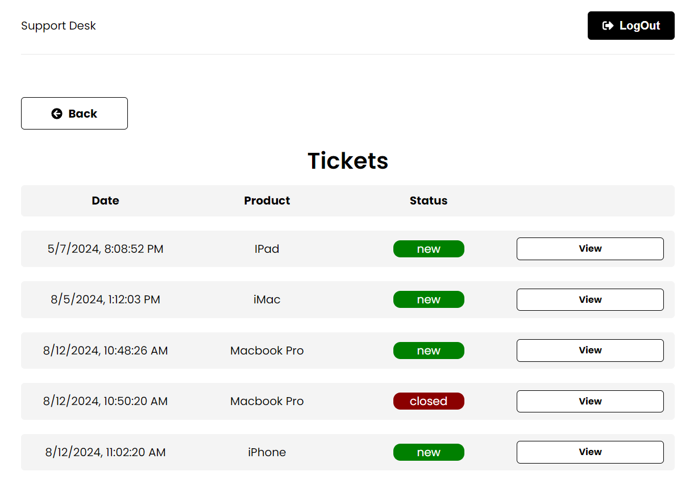

# Desk Support application
## A MERN application, build it with NodeJS, TS, JS, MongoDB and of course React
## There are 2 folders (frontend and backend) to split the logic, whether in the BE as in the FE
## Here we have some screen shots of the application running

